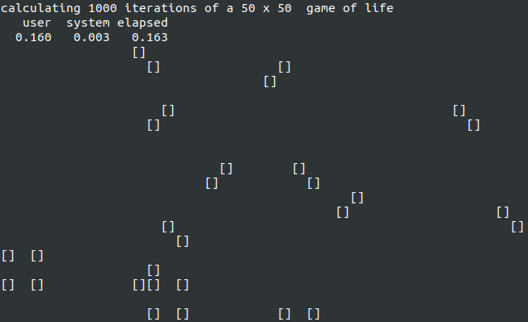

# A simple, straightforward implementation of "Conway's Game of Life"

## Setup

Follow the instructions from the top level [README](../README.md) to install and setup GraalVM.

## Run

Execute the `run.sh` script or `${GRAALVM_DIR}/bin/Rscript gameoflife.R`
